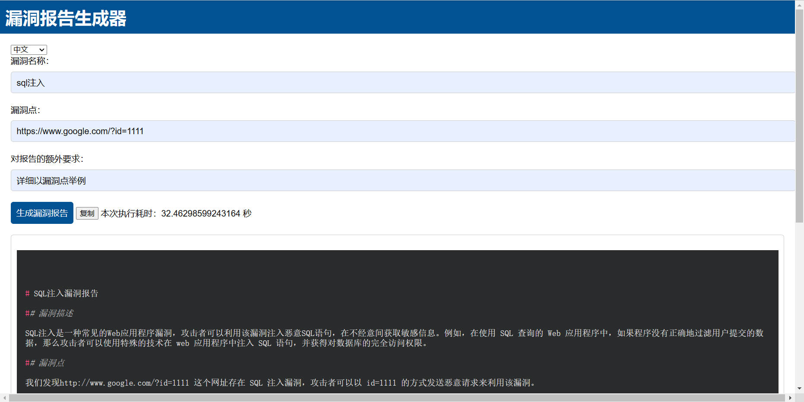
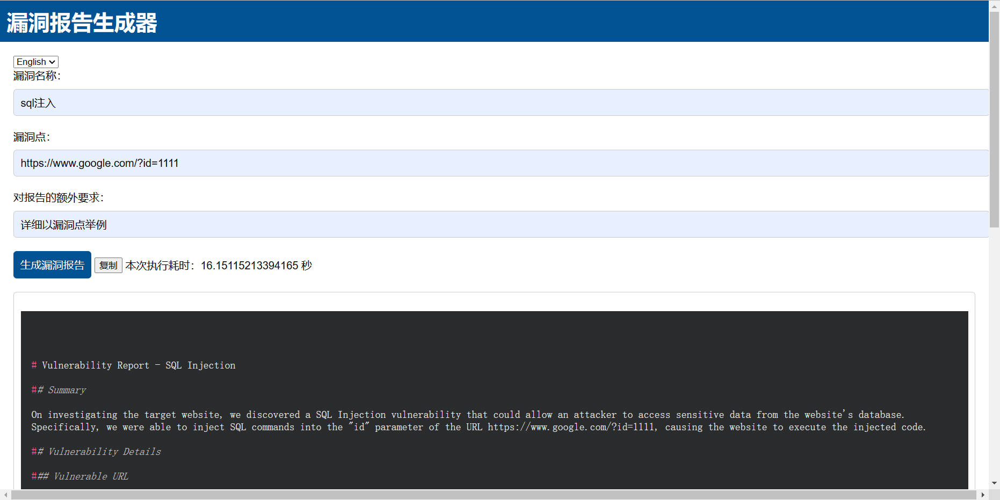

# GPTreport
Generate makedown vulnerability reports using ChatGPT automatically.

使用openai api自动生成makedown漏洞报告。

默认使用GPT3.5

手动修改main.py第10行开始的配置信息

api_key = "sk-xxxxxxxxxx" //openai key官网获取  

model_engine = "gpt-3.5-turbo" //模型默认gpt-3.5  

proxy = "http://127.0.0.1:7890" //代理地址  

可选择生成中文/英文makedown格式报告，点击按钮可复制到剪切板  

  

​     

